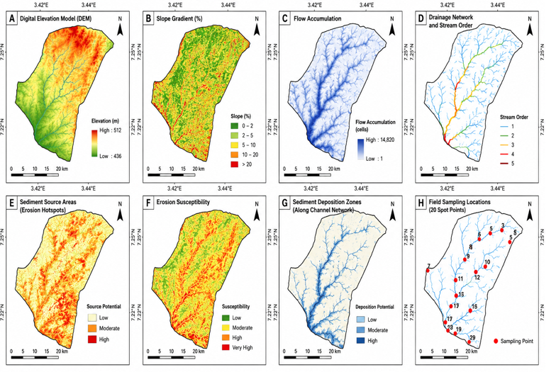
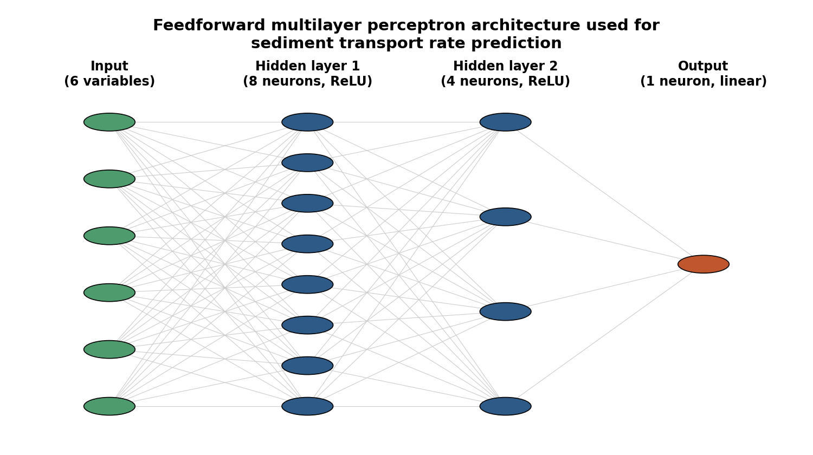
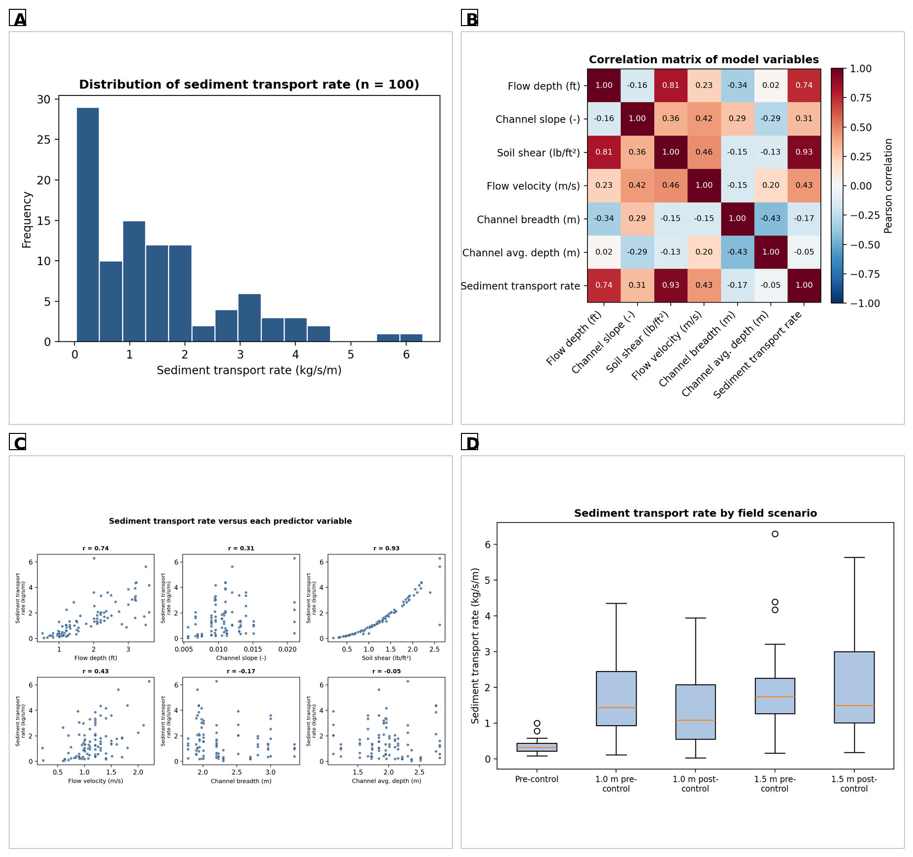
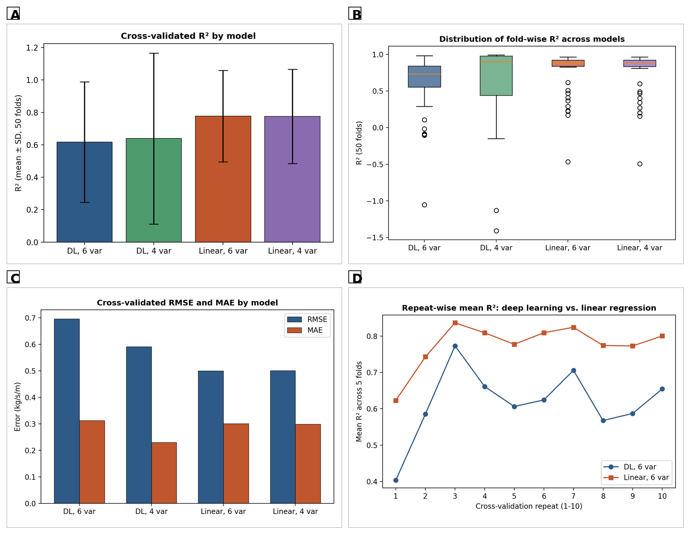
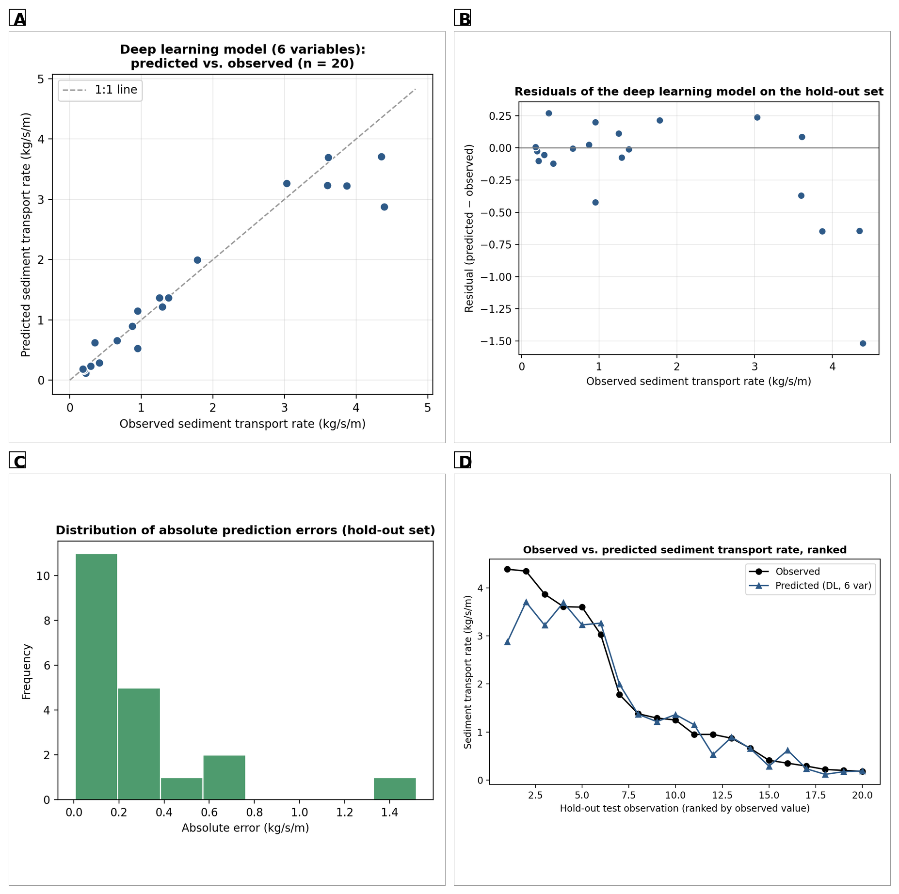
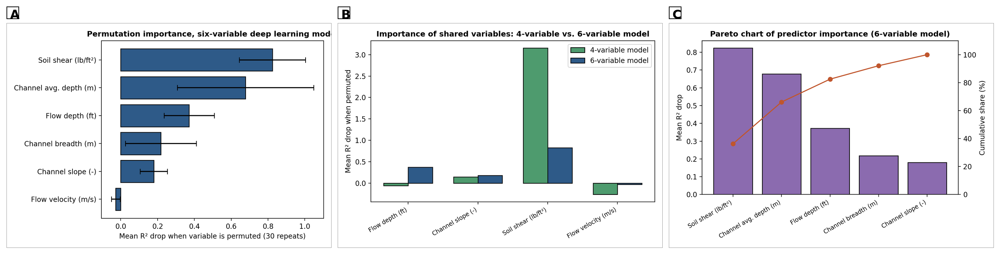
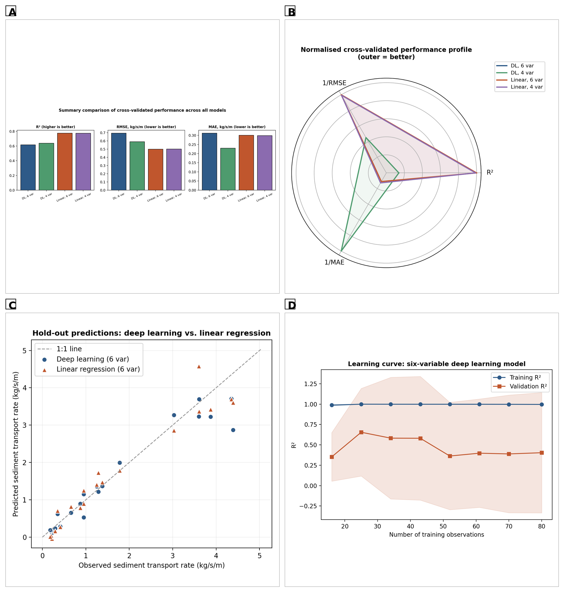
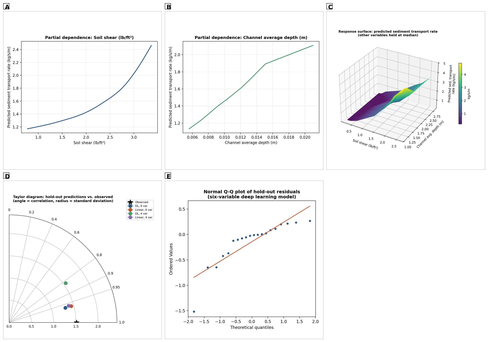
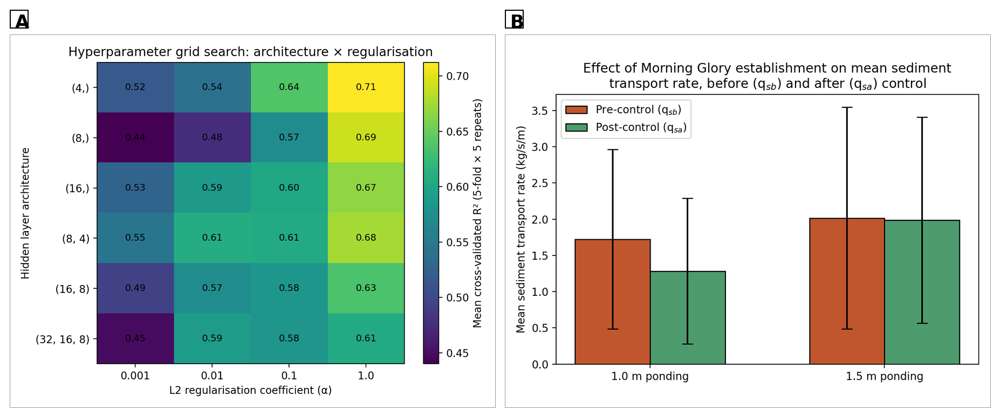
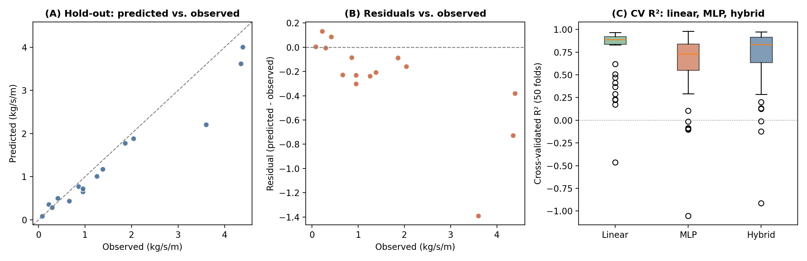

# A Hybrid CNN-BiLSTM-Attention Deep Learning Framework for Sediment Transport in an Agricultural Gully System

**Author:** Naziru Halilu

This repository accompanies the manuscript (`manuscript/Halilu_Sediment_Transport.docx`),
comparing benchmark MLP/linear-regression models against a Hybrid
CNN-BiLSTM-Attention model for predicting sediment transport rate in an
agricultural gully system.

## Figures

All 11 figures from the manuscript, extracted directly from the manuscript:


**Figure 1** — Geospatial characterisation of the study watershed: digital
elevation model, slope gradient, flow accumulation, drainage network, sediment
source area, erosion susceptibility, sediment deposition zones, and field
sampling locations.


**Figure 2** — Feedforward multilayer perceptron (MLP) architecture used as a
benchmark for sediment transport rate prediction.


**Figure 3** — Exploratory data analysis (n = 100): distribution of sediment
transport rate, correlation matrix, predictor scatter plots, and distribution
by field scenario.


**Figure 4** — Cross-validated performance across models: mean R², fold-wise R²
distribution, and RMSE/MAE across folds.


**Figure 5** — Hold-out performance of the six-variable benchmark MLP (n = 20):
predicted vs. observed, residuals, error distribution, and ranked values.


**Figure 6** — Permutation importance for the six-variable deep-learning model,
the shared hydraulic variables across the four- and six-variable models, and a
Pareto chart of predictor importance.


**Figure 7** — Model comparison summary: cross-validated R²/RMSE/MAE across all
four models, normalised performance profile, hold-out prediction overlay, and
learning curve.


**Figure 8** — Advanced diagnostics for the six-variable deep-learning model:
partial dependence plots, 3-D response surface, Taylor diagram, and Q-Q plot of
residuals.


**Figure 9** — Hyperparameter grid search results, and mean sediment transport
rate before and after Morning Glory establishment at two ponding depths.


**Figure 10** — Hybrid CNN-BiLSTM-Attention model performance: predicted vs.
observed on the hold-out test set, residuals, and cross-validated R² comparison
across the linear, MLP, and hybrid models.


**Figure 11** — Hybrid model interpretability and uncertainty: permutation
importance, Kernel SHAP summary, and Monte Carlo dropout prediction intervals.

---

## Contents

- `data/`
  - `table41.csv` — channel geometric survey (breadth, depth1, depth2, average
    depth, slope) at 20 stations.
  - `data.csv` — the 100-observation hydraulic dataset (depth, slope, soil shear,
    sediment transport rate, velocity) across 5 field scenarios.
  - `data_full.csv` — merged dataset (100 rows) combining the hydraulic dataset
    with channel breadth and average channel depth, matched spot-by-spot via
    slope alignment. This is the dataset used to train all models.

- `full_analysis.py` — main analysis script for the benchmark models: trains and
  cross-validates the 6-variable and 4-variable MLP and linear-regression models,
  computes hold-out performance, and computes permutation importance.

- `hybrid_model/` — the NumPy implementation of the Hybrid CNN-BiLSTM-Attention
  model (Section 2.7.1 of the manuscript), including a gradient-check module for
  verifying backward-pass correctness. See `hybrid_model/README_hybrid.md` for
  the full architectural documentation.

- `run_hybrid_analysis.py` — runs the full hybrid-model cross-validation,
  hold-out, permutation-importance, Monte Carlo dropout, and Kernel SHAP
  pipeline. Writes `results/hybrid_*`.

- `make_charts.py` — generates the benchmark-model (MLP/linear) analysis charts.
- `make_hybrid_charts.py` — generates the hybrid-model analysis charts.

- `figures/` — all 11 figures referenced in the manuscript, extracted directly
  from the manuscript document.

- `results/` — numeric outputs from both the benchmark and hybrid model
  pipelines: cross-validation results, hold-out metrics, permutation importance,
  Kernel SHAP values, Monte Carlo dropout distributions, and bootstrap
  confidence intervals.

## How to Run the Code

### 1. Clone the repository

```bash
git clone https://github.com/halilunaziru73-creator/Hybrid-CNN-BiLSTM-Attention-Sediment-Transport-Agricultural-Gully-System.git
cd Hybrid-CNN-BiLSTM-Attention-Sediment-Transport-Agricultural-Gully-System
```

### 2. Install dependencies and reproduce the results

```bash
pip install scikit-learn pandas numpy scipy matplotlib --break-system-packages

# Benchmark MLP / linear regression models
python3 full_analysis.py
python3 make_charts.py

# Hybrid CNN-BiLSTM-Attention model (~15 min)
python3 -m hybrid_model.gradcheck      # verify backward-pass correctness first
python3 run_hybrid_analysis.py
python3 make_hybrid_charts.py
```

## Model summary

- **Benchmark architecture:** feedforward multilayer perceptron, 6 (or 4) input
  neurons → 8 neurons (ReLU) → 4 neurons (ReLU) → 1 linear output neuron.
  L-BFGS optimiser, L2 regularisation (α = 0.1).
- **Primary architecture (hybrid):** Conv1D(1→8) → Conv1D(8→16) →
  BiLSTM(8/direction) → attention pooling → Dense(16, ReLU) + Dropout(0.2) →
  linear output. Weighted Huber loss, L2 (α = 1e-3), Adam optimiser. See
  `hybrid_model/README_hybrid.md` for the full specification.
- **Evaluation:** 5-fold cross-validation repeated 10 times (50 folds total),
  an independent hold-out split, and permutation importance for both model
  families; the hybrid model additionally includes Monte Carlo dropout
  uncertainty and Kernel SHAP.
- **Headline results:** benchmark MLP cross-validated R² = 0.62 ± 0.37,
  hold-out R² = 0.91 (6-variable); hybrid model cross-validated R² = 0.68 ± 0.36,
  hold-out R² = 0.90. See the manuscript for full details, governing equations,
  and discussion.

## License

Released under the [MIT License](./LICENSE).
